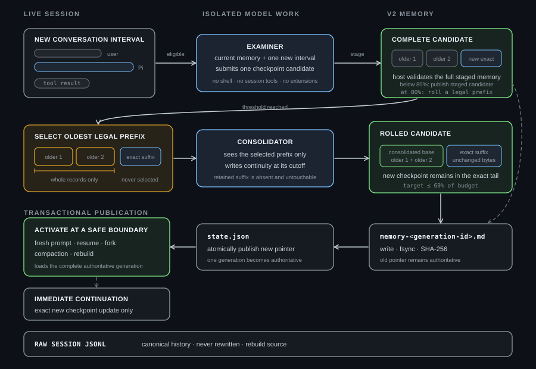

# Pi Session Refinement

Pi Session Refinement gives each saved Pi conversation its own chronological memory. A refinement model turns new stretches of conversation into checkpoints. When memory grows, a separate consolidator replaces the oldest record prefix with a compact continuity checkpoint. Pi loads the latest memory after compaction or resume while ordinary turns keep the same prompt snapshot.

The extension runs only in persistent interactive root sessions. Spawned children and `--no-session` runs do not create refinement memory.

## What happens during a session

A background checkpoint becomes eligible after both the time threshold and root tool-result threshold have been met. The refinement model reads the current memory and the unprocessed conversation interval, then submits one exact checkpoint candidate.

The extension stages that candidate before touching active memory. If the candidate reaches 80% of `memoryBudgetTokens`, it evaluates legal whole-record ranges that can actually leave the complete memory at 60% of budget or less, then prefers selected rendered mass closest to half the budget. A fork range must stay wholly inherited or wholly local. The consolidator sees only that range and receives the exact remaining body allowance after retained memory and host metadata costs. The host still rejects malformed, non-compressing, or oversized output.

Publication writes a new immutable memory generation first, then atomically replaces the state file that names and hashes it. The old state remains authoritative until that pointer commit; superseded and failed-attempt generations are removed best-effort.

Memory can advance on disk while the current prompt keeps its previous snapshot. Pi activates the new snapshot after compaction, resume, fork bootstrap, or a successful rebuild. If Pi continues the same run immediately after compaction, the extension supplies the exact new checkpoint as an additive update on every model call until the next fresh prompt. This remains safe when disk memory was consolidated: the consolidation body is never sent as a lower-priority replacement for the stale system-prompt memory.



[View the behavior checklist](docs/session-flow-ascii.md).

## Features

- v2 rolling memory for each persistent root session
- Separate configurable refinement and consolidation models, resolved through Pi's model registry
- Background work gated by elapsed time and root tool activity
- Early context compaction after refinement has had a chance to save material leaving context
- Stable prompt snapshots plus the existing immediate post-compaction append bridge
- Crash-atomic generation publication with deterministic token and headroom checks
- Deliberately cheap fork inheritance with an immutable rebuild floor
- Manual reconstruction through `/session-refinement-rebuild`
- Non-modal animated progress above the editor
- Immediate retries and fallback to the current session model
- Usage records kept outside model context

## Use it

Give this repository URL to your coding agent:

`https://github.com/TobyNoSkillSon/pi-session-refinement`

Tell it you want Pi Session Refinement. It can inspect your Pi setup and install the package.

## Configuration

Runtime configuration belongs to the active Pi profile:

```text
${PI_CODING_AGENT_DIR}/pi-session-refinement/config.json
```

All fields are optional:

```json
{
  "enabled": true,
  "model": "current",
  "thinking": "high",
  "consolidator": {
    "model": "current",
    "thinking": "high"
  },
  "memoryBudgetTokens": 32000,
  "triggers": {
    "contextPercent": 80,
    "elapsedMinutes": 40,
    "minimumToolCalls": 25
  },
  "runOnManualCompaction": true,
  "maxAttempts": 3
}
```

Both model fields accept `current`, an exact `provider/model-id`, or a unique available bare model ID. The package does not choose a provider. See [configuration](docs/configuration.md) for details.

## Runtime files

```text
${PI_CODING_AGENT_DIR}/pi-session-refinement/
├── config.json
└── sessions/
    └── <session-id>/
        ├── state.json
        └── generations/
            └── memory-<generation-id>.md
```

`state.json` names and hashes the sole authoritative v2 generation. `memory.md` exists only for read-only v1 compatibility and is removed after a successful rebuild. Superseded generation files are transaction debris, not an archive, and are cleaned best-effort. Runtime files stay outside the installed package and repository. Raw Pi JSONL remains the canonical session history.

## Compatibility and rebuilds

v2 does not migrate older state automatically. A valid v1 memory remains available to the model, but the extension treats it as read-only and warns on every turn until you run:

```text
/session-refinement-rebuild
```

The same command creates v2 memory for a historical session that has no refinement files. A rebuild processes the root branch from its beginning. On a v2 fork, it preserves the inherited baseline and processes only fork-local history after the recorded floor. Staging uses the same automatic consolidation rules as normal refinement. Active memory changes only after every segment succeeds.

## Forks

A child receives only the active v2 record prefix valid at the selected fork point. The child records that point as an immutable rebuild floor and starts normal processing after it. It never replays the parent's JSONL automatically. An old fork may inherit little or nothing when it predates the parent's rolling base; this is intentional.

A v1 fork remains legacy and read-only until an explicit rebuild. Rebuild converts a valid inherited v1 baseline and still starts raw reconstruction after the recorded fork floor. If inherited v1 prose is corrupt, the documented lossy rule drops that baseline but retains the floor; parent history is never replayed as a substitute.

## Failure policy

Refinement and consolidation are fail-open. Model resolution uses configured attempts followed by the current session model when available. A failed refinement leaves active memory and its transcript cursor unchanged, so raw JSONL can regenerate the interval.

If every consolidation attempt fails, or no valid candidate creates real headroom, the extension records `consolidation-failed`, pauses automatic refinement for that session, and asks you to run the rebuild command. Pi remains usable. The warning does not disable early context compaction.

Unreadable or inconsistent state follows the same manual-rebuild policy. The extension does not scan sibling sessions, run mass migration, retain permanent old-memory archives, or edit raw history.

## Privacy

The repository contains no credentials, personal paths, private model configuration, or session data. Runtime memory uses private file permissions. Each model operation sees only the session material needed for that operation; the consolidator never receives the retained suffix.

## Development

```bash
npm install
npm run check
```

## License

MIT
